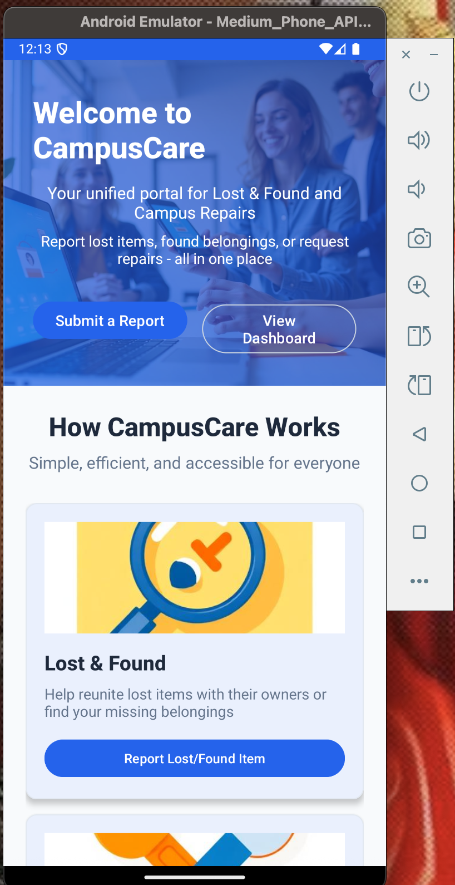
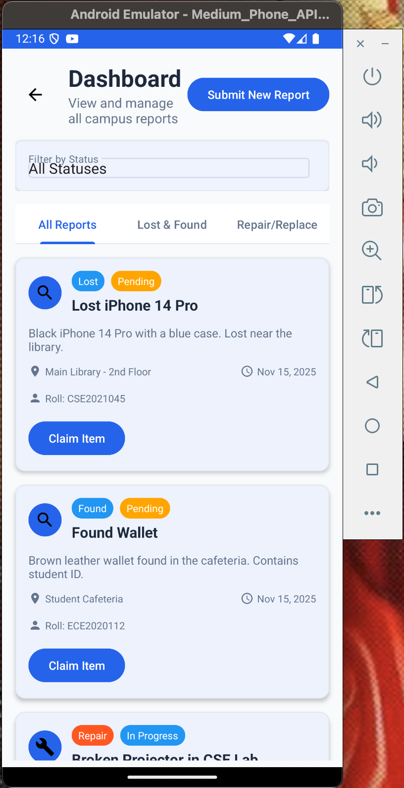
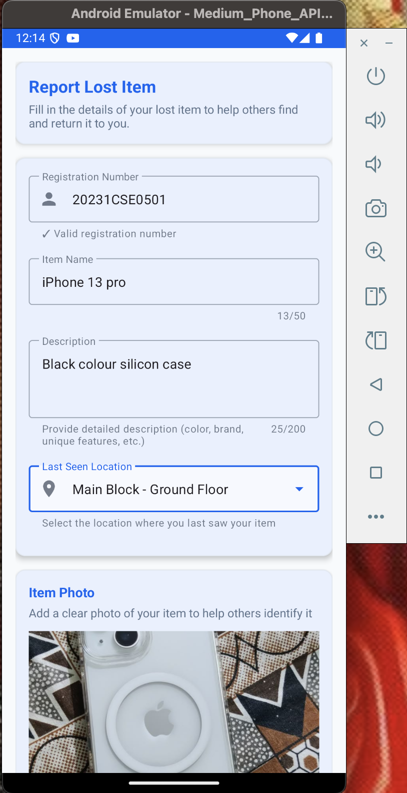
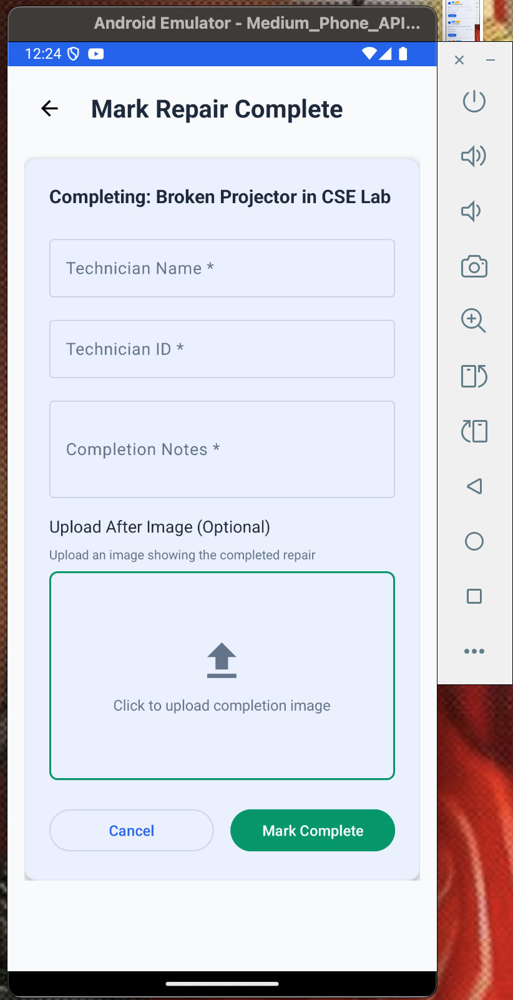
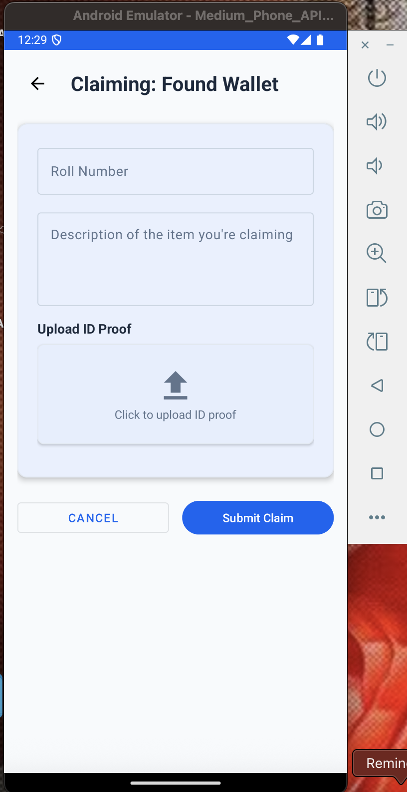
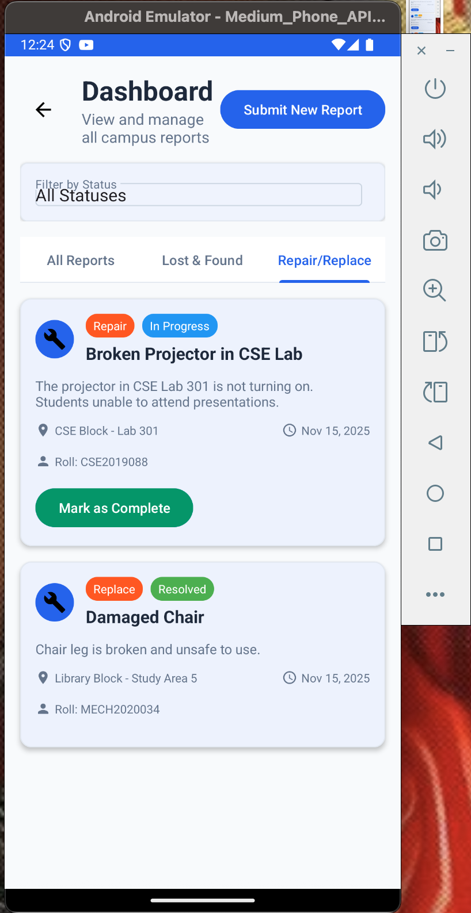

# 🏫 CampusCare

> **A Comprehensive Campus Facility Management & Lost/Found Solution**

CampusCare is a smart Android application designed to streamline campus facility management. It serves as a bridge between students/staff and the administration, enabling efficient reporting of maintenance issues and managing lost/found items.

---

## 🚀 Features

### 🛠️ Facility Management (Repair/Replace)
- **Report Issues**: Easily report broken assets or maintenance requirements (e.g., faulty ACs, broken furniture, lighting issues).
- **Track Status**: view real-time status of reported issues (Pending, In Progress, Resolved).
- **Technician Portal**: Designated technicians can update the status of repairs, add completion notes, and upload proof of work (images).

### 🔍 Lost & Found
- **Report Lost Items**: Quickly post details about lost belongings.
- **Found Items**: Browse the database of found items.
- **Claim Process**: Securely claim items through the application listing.

### 📊 Dashboard
- **Centralized View**: Filter reports by category (Lost & Found vs. Repairs) or status.
- **User-Friendly Interface**: Built with Material Design principles for a seamless experience.

---

## 🛠️ Tech Stack

 
 
 


- **Frontend**: Native Android (Java/Kotlin Mixed)
- **Backend**: Firebase Firestore, Firebase Authentication
- **Storage**: Firebase Storage (for images)
- **UI/UX**: Material Design Components

---

## 📱 Screenshots

| Landing page | Dashboard | Report Issue | Technician View | Claiming Item | dashboard showing repair replace |
|:---:|:---:|:---:|:---:|:---:|:---:|
|  |  |  |  |  |  |


---

## 👾 Demo Video

Here is a short demonstration of the CampusCare app in action:

[](https://youtu.be/TMW2U3cn1k4)

*(Note: Click the image above to watch the demo on YouTube)*

---

## 🏃 Getting Started

1. **Clone the repository**
   ```bash
   git clone https://github.com/keerthans334/CampusCare.git
   ```

2. **Open in Android Studio**
   - Open Android Studio and select "Open an existing Android Studio project".
   - Navigate to the cloned directory.

3. **Firebase Setup**
   - Create a project in [Firebase Console](https://console.firebase.google.com/).
   - Add an Android app with package name `com.campuscare.app`.
   - Download the `google-services.json` file.
   - Place it in the `app/` directory.

4. **Build and Run**
   - Sync Gradle files.
   - Run the app on an Emulator or Physical Device.

---

## 🤝 Contribution

Contributions are welcome! Please follow these steps:
1. Fork the repository.
2. Create a new branch (`git checkout -b feature/YourFeature`).
3. Commit your changes (`git commit -m 'Add some feature'`).
4. Push to the branch (`git push origin feature/YourFeature`).
5. Open a Pull Request.

---

## 🌐 Connect with Me

[](https://www.facebook.com/keerthan.shetty.900) [](https://www.instagram.com/keerthan_07x?igsh=MTZ5amgyZmFhZGI1dA==) [](www.linkedin.com/in/keerthanshetty334krishimitraaifarmauralead07072005) [](https://github.com/keerthans334)

---
<p align="center">
  Made with ❤️ by <a href="https://github.com/keerthans334">Keerthan Shetty</a>
</p>
